# Testing Results

## 11th Gen Intel Core™ i7-11800H (16 threads)

Hash: 4371eb592ea36da3340d85bc8898eb6a4824a0a7

- Particles: 1,000
- Active batches: 1,000
- Inactive batches: 100

| QOI                     | Delta Tracking (old majorant) | Delta Tracking (manual majorant) | Surface Tracking     |
| ----------------------- | ----------------------------- | -------------------------------- | -------------------- |
| k-eff  (Collision)      | 1.22270 +/- 0.00129           | 1.22272 +/- 0.00131              | 1.22035 +/- 0.00128  |
| Leakage Fraction        | 0.17496 +/- 0.00043           | 0.17508 +/- 0.00040              | 0.17507 +/- 0.00042  |
| Active Tracking Rate    | 3297.29                       | 10760.9                          | 2210.03              |
| Inactive Tracking Rate  | 3911.72                       | 13400.9                          | 2328.13              |

- Particles: 10,000
- Active batches: 1,000
- Inactive batches: 100

| QOI                     | Delta Tracking (old majorant) | Delta Tracking (manual majorant) | Surface Tracking     |
| ----------------------- | ----------------------------- | -------------------------------- | -------------------- |
| k-eff  (Collision)      | 1.22126 +/- 0.00039           | 1.22255 +/- 0.00039              | 1.22126 +/- 0.00041  |
| Leakage Fraction        | 0.17495 +/- 0.00013           | 0.17471 +/- 0.00014              | 0.17484 +/- 0.00013  |
| Active Tracking Rate    | 3614.89                       | 11262.4                          | 2144.83              |
| Inactive Tracking Rate  | 3714.89                       | 11853.7                          | 2170.55              |

- Particles: 100,000
- Active batches: 1,000
- Inactive batches: 100

HPC resources necessary for this case.

### Flux Spectra

  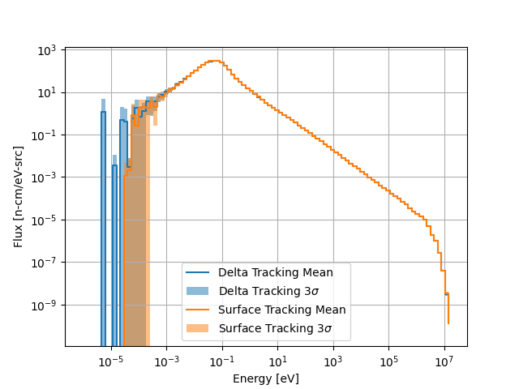
  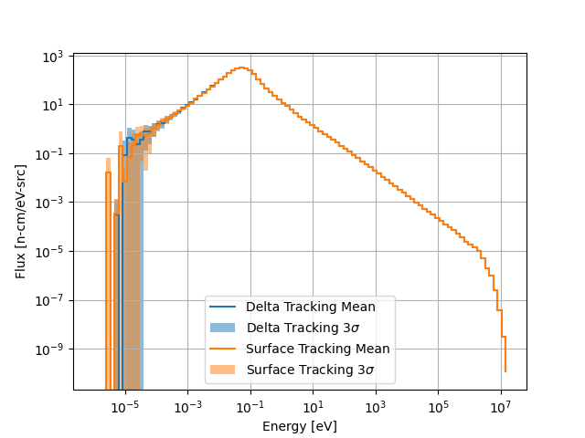

Spectrum comparisons for 1000 and 10000 particles per batch (left to right).

### Flux Distributions

  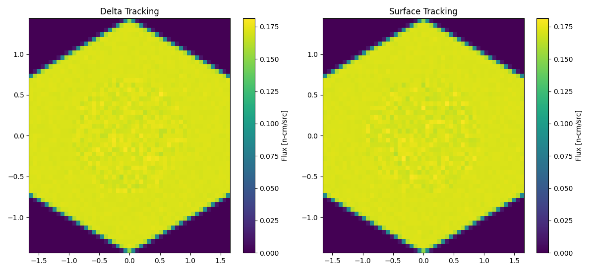

1000 particles per batch.

  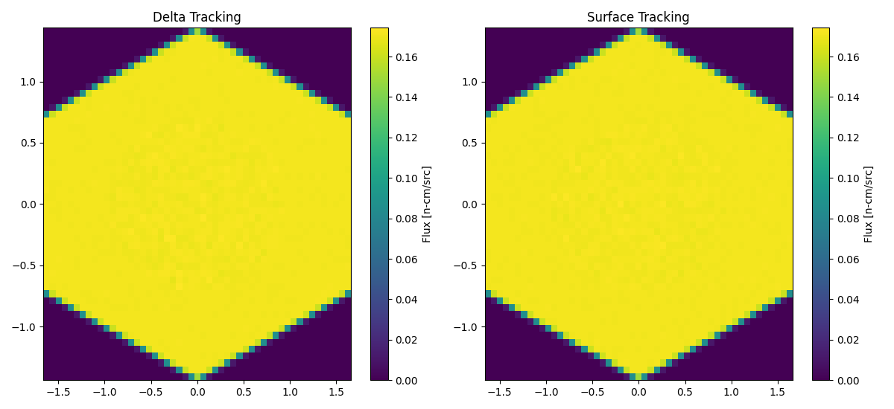

10000 particles per batch.

### Flux Statistical Error Distributions

  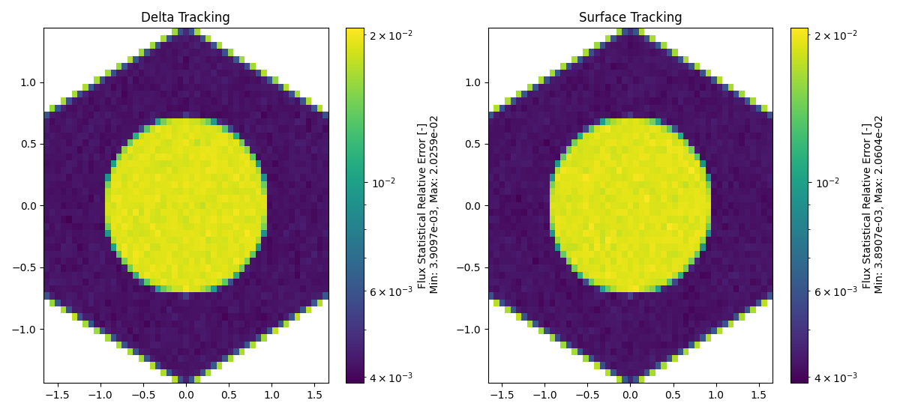

1000 particles per batch.

  

10000 particles per batch.

### Flux Relative Error Distributions

  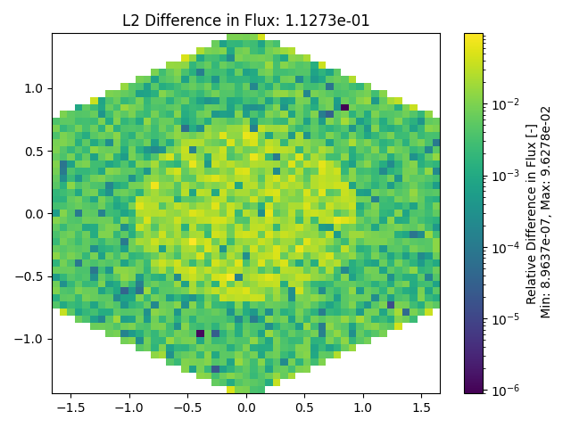
  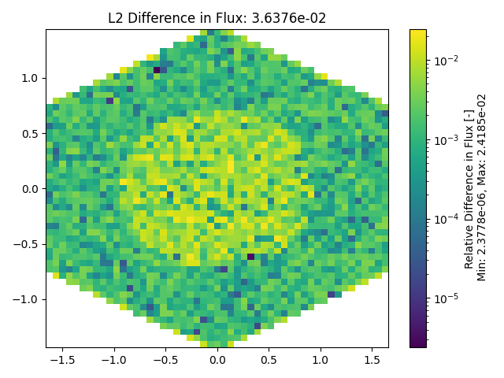

1000 and 10000 particles per batch (left to right).

### Total Reaction Rate Distributions

  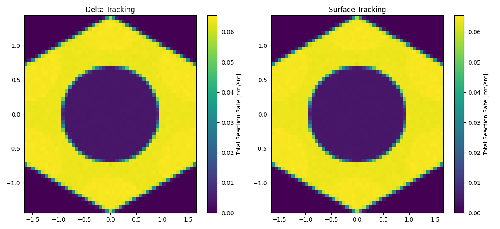

1000 particles per batch.

  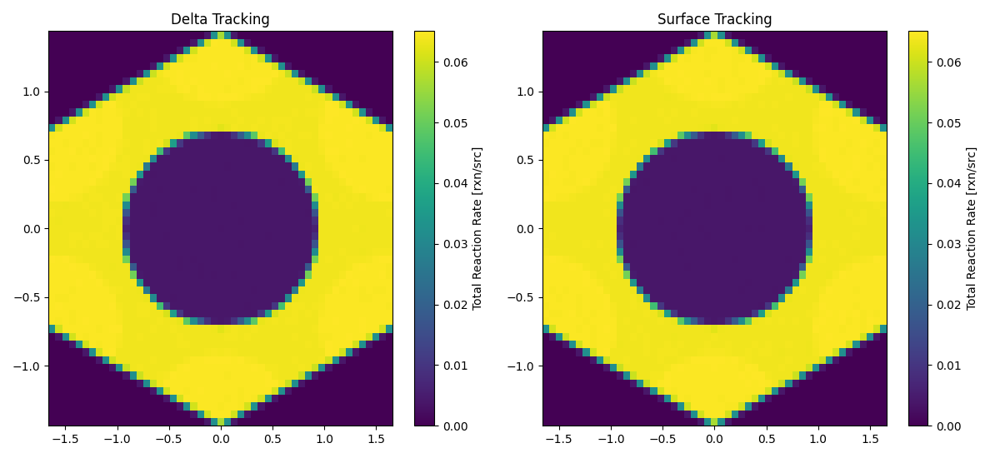

10000 particles per batch.

### Total Reaction Rate Statistical Error Distributions

  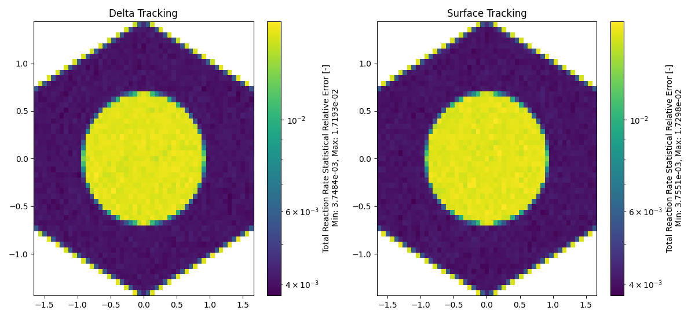

1000 particles per batch.

  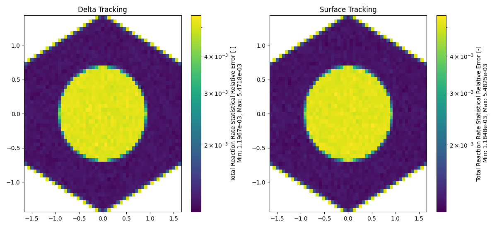

10000 particles per batch.

### Total Reaction Rate Relative Error Distributions

  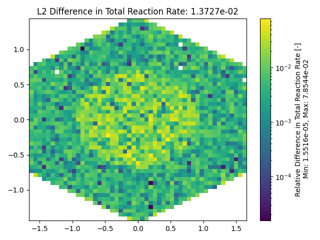
  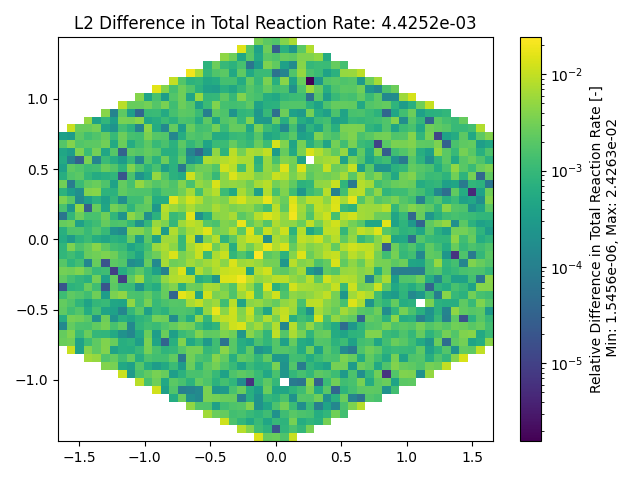

1000 and 10000 particles per batch (left to right).

