# Testing Results

## 11th Gen Intel Core™ i7-11800H (16 threads)

Hash: 17fee0db263a492ea66758854e2c16ffd036b225

- Particles: 1,000
- Active batches: 1,000
- Inactive batches: 100

| QOI                     | Delta Tracking       | Surface Tracking     |
| ----------------------- | -------------------- | -------------------- |
| k-eff  (Collision)      | 0.99909 +/- 0.00107  | 0.99839 +/- 0.00103  |
| Leakage Fraction        | 0.67269 +/- 0.00045  | 0.67318 +/- 0.00046  |
| Active Tracking Rate    | 449562               | 1.10926e+06          |
| Inactive Tracking Rate  | 1.14303e+06          | 1.54026e+06          |

- Particles: 10,000
- Active batches: 1,000
- Inactive batches: 100

| QOI                     | Delta Tracking       | Surface Tracking     |
| ----------------------- | -------------------- | -------------------- |
| k-eff  (Collision)      | 0.99921 +/- 0.00035  | 1.00001 +/- 0.00034  |
| Leakage Fraction        | 0.67298 +/- 0.00016  | 0.67288 +/- 0.00014  |
| Active Tracking Rate    | 1.79253e+06          | 1.73149e+06          |
| Inactive Tracking Rate  | 1.84586e+06          | 1.73149e+06          |

- Particles: 100,000
- Active batches: 1,000
- Inactive batches: 100

| QOI                     | Delta Tracking       | Surface Tracking     |
| ----------------------- | -------------------- | -------------------- |
| k-eff  (Collision)      | 0.99959 +/- 0.00011  | 1.00000 +/- 0.00010  |
| Leakage Fraction        | 0.67263 +/- 0.00005  | 0.67311 +/- 0.00005  |
| Active Tracking Rate    | 1.8773e+06           | 1.96127e+06          |
| Inactive Tracking Rate  | 2.39271e+06          | 2.20391e+06          |

### Flux Spectra

  
  
  

Spectrum comparisons for 1000, 10000, and 100000 particles per batch (left to right).

### Flux Distributions

  

1000 particles per batch.

  

10000 particles per batch.

  

100000 particles per batch.

### Flux Statistical Error Distributions

  

1000 particles per batch.

  

10000 particles per batch.

  

100000 particles per batch.

### Flux Relative Error Distributions

  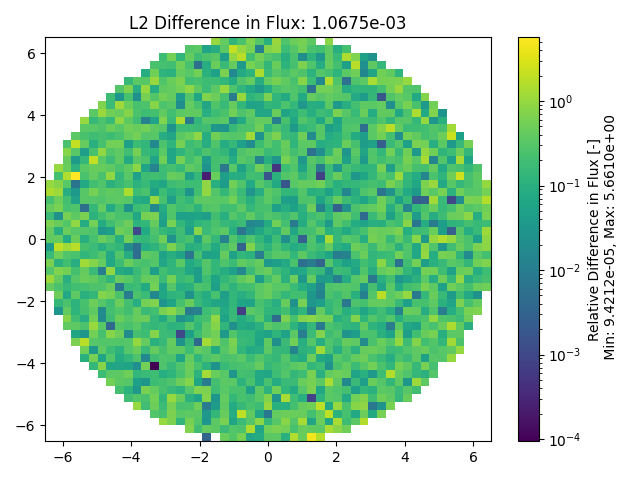
  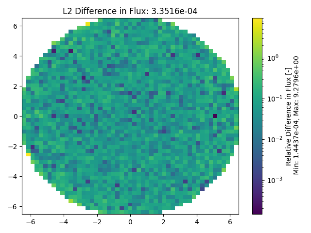
  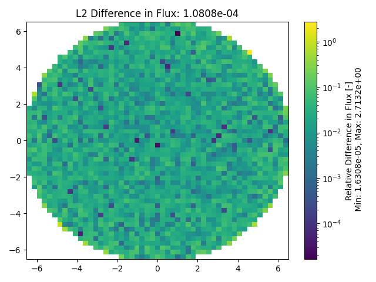

1000, 10000, and 100000 particles per batch (left to right).

### Total Reaction Rate Distributions

  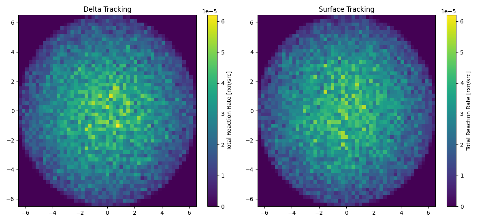

1000 particles per batch.

  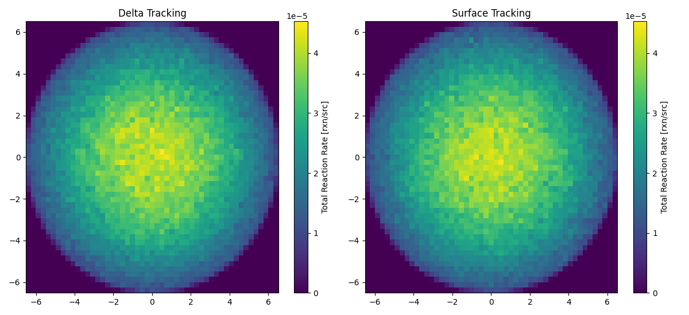

10000 particles per batch.

  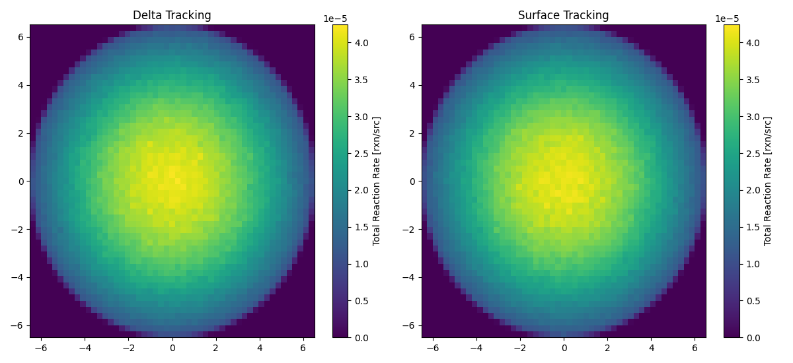

100000 particles per batch.

### Total Reaction Rate Statistical Error Distributions

  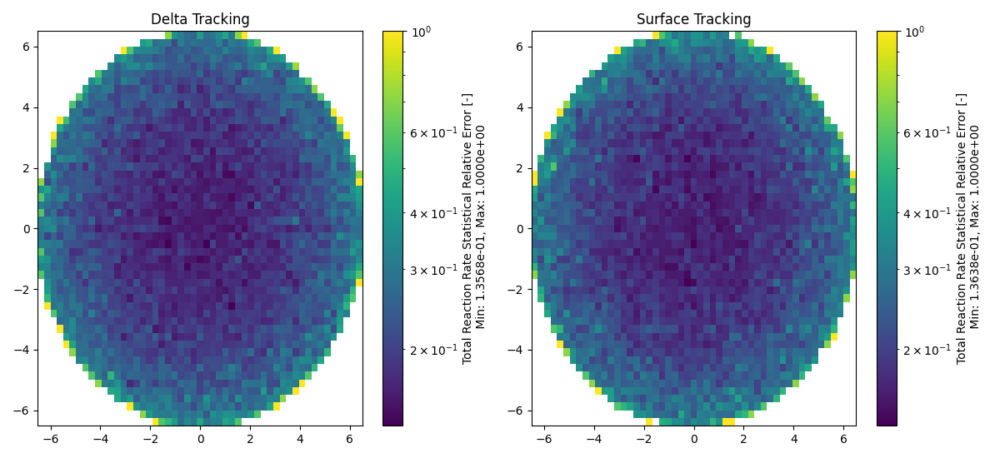

1000 particles per batch.

  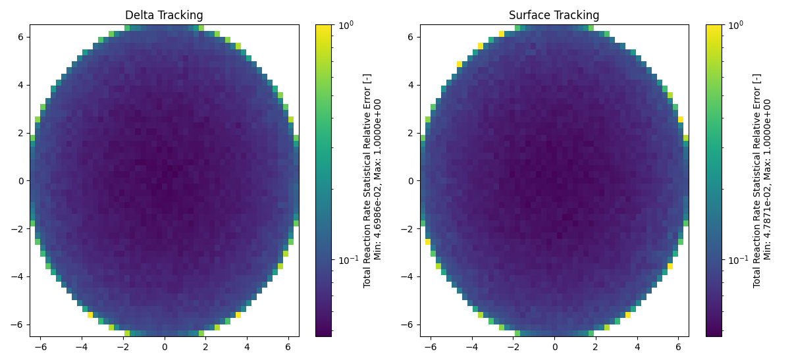

10000 particles per batch.

  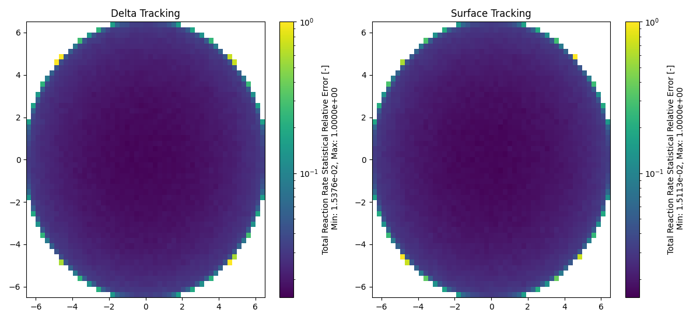

100000 particles per batch.

### Total Reaction Rate Relative Error Distributions

  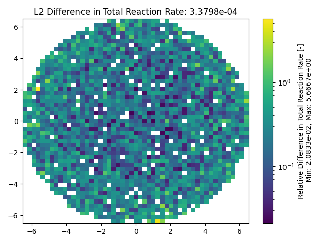
  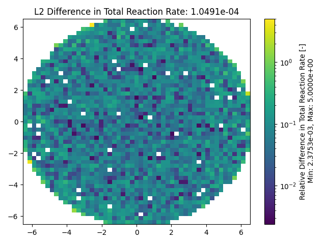
  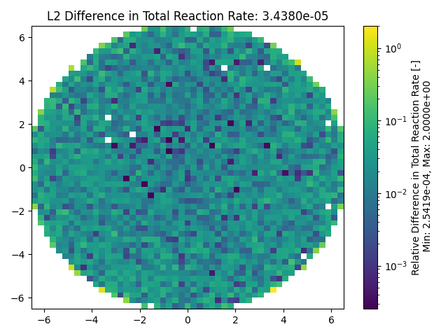

1000, 10000, and 100000 particles per batch (left to right).

