# Testing Results

## 11th Gen Intel Core™ i7-11800H (16 threads)

Hash: 86ada06bd372bdaca3c4220d8952e6b785b7a640

- Particles: 1,000
- Active batches: 1,000
- Inactive batches: 100

| QOI                     | Delta Tracking       | Surface Tracking     |
| ----------------------- | -------------------- | -------------------- |
| k-eff  (Collision)      | 1.00070 +/- 0.00106  | 0.99839 +/- 0.00103  |
| Leakage Fraction        | 0.67251 +/- 0.00048  | 0.67318 +/- 0.00046  |
| Active Tracking Rate    | 449562               | 1.10926e+06          |
| Inactive Tracking Rate  | 1.14303e+06          | 1.54026e+06          |

- Particles: 10,000
- Active batches: 1,000
- Inactive batches: 100

| QOI                     | Delta Tracking       | Surface Tracking     |
| ----------------------- | -------------------- | -------------------- |
| k-eff  (Collision)      | 0.99904 +/- 0.00034  | 1.00001 +/- 0.00034  |
| Leakage Fraction        | 0.67278 +/- 0.00015  | 0.67288 +/- 0.00014  |
| Active Tracking Rate    | 1.79253e+06          | 1.73149e+06          |
| Inactive Tracking Rate  | 1.84586e+06          | 1.73149e+06          |

- Particles: 100,000
- Active batches: 1,000
- Inactive batches: 100

| QOI                     | Delta Tracking       | Surface Tracking     |
| ----------------------- | -------------------- | -------------------- |
| k-eff  (Collision)      | 0.99978 +/- 0.00011  | 1.00000 +/- 0.00010  |
| Leakage Fraction        | 0.67262 +/- 0.00005  | 0.67311 +/- 0.00005  |
| Active Tracking Rate    | 1.8773e+06           | 1.96127e+06          |
| Inactive Tracking Rate  | 2.39271e+06          | 2.20391e+06          |

### Spectra

  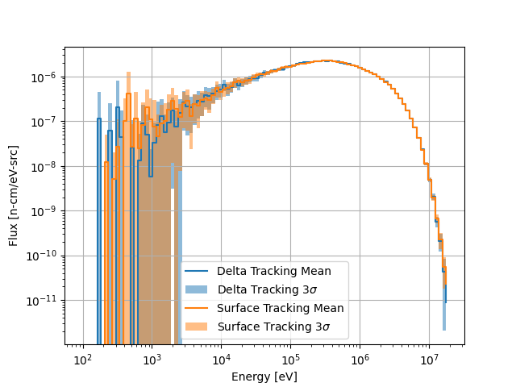
  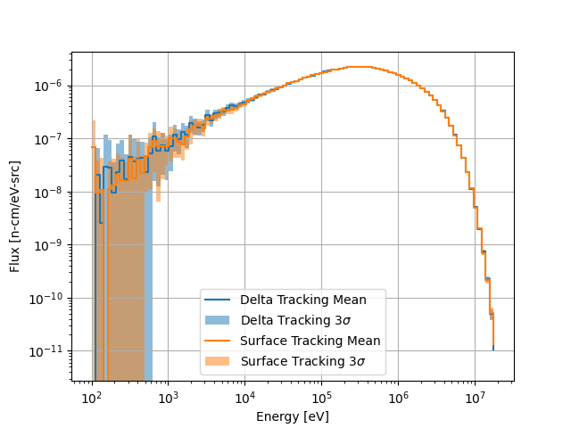
  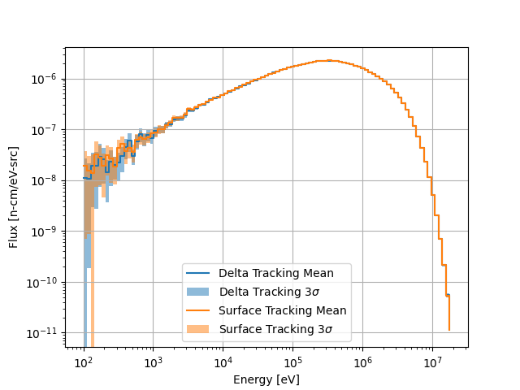

Spectrum comparisons for 1000, 10000, and 100000 particles per batch (left to right).

### Flux Distributions

  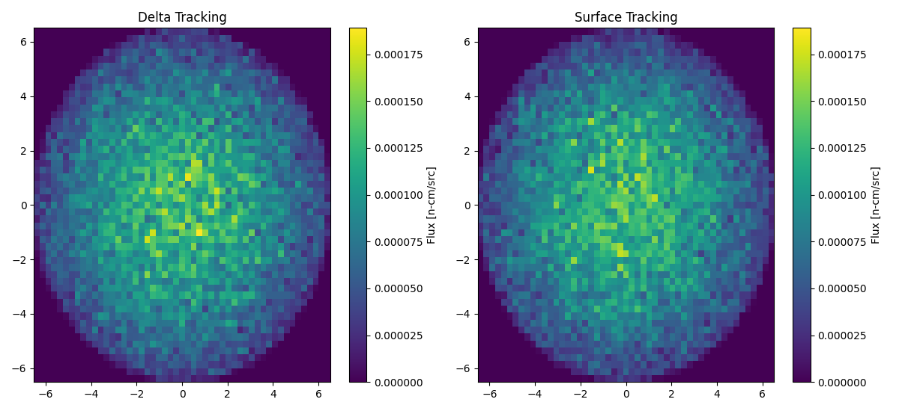

Flux distribution with 1000 particles per batch.

  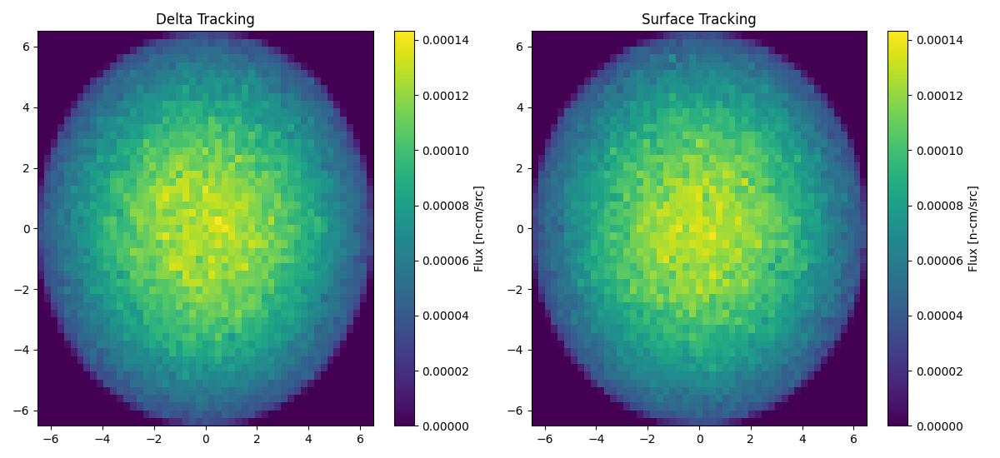

Flux distribution with 10000 particles per batch.

  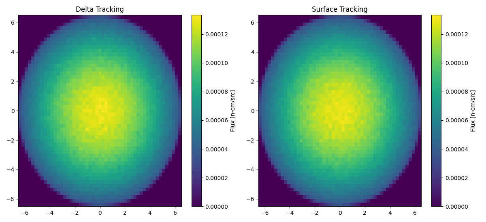

Flux distribution with 100000 particles per batch.

### Flux Statistical Error Distributions

  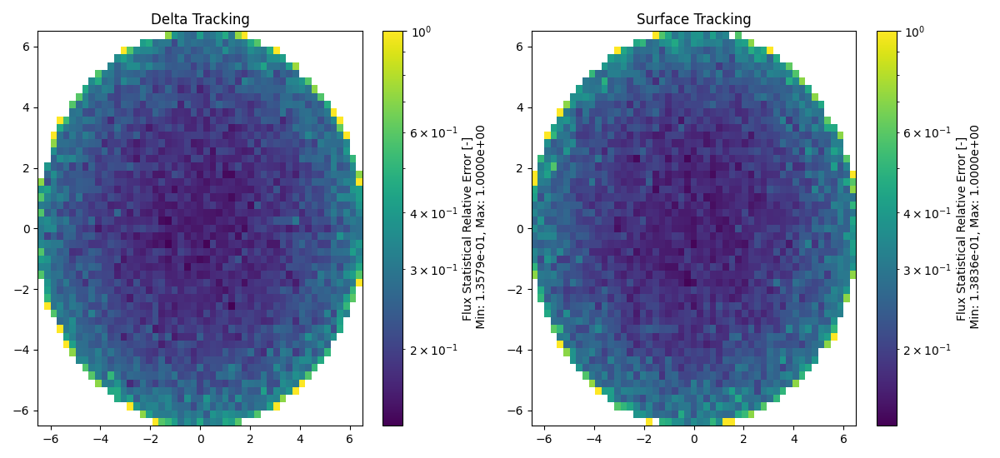

Flux statistical relative error distribution with 1000 particles per batch.

  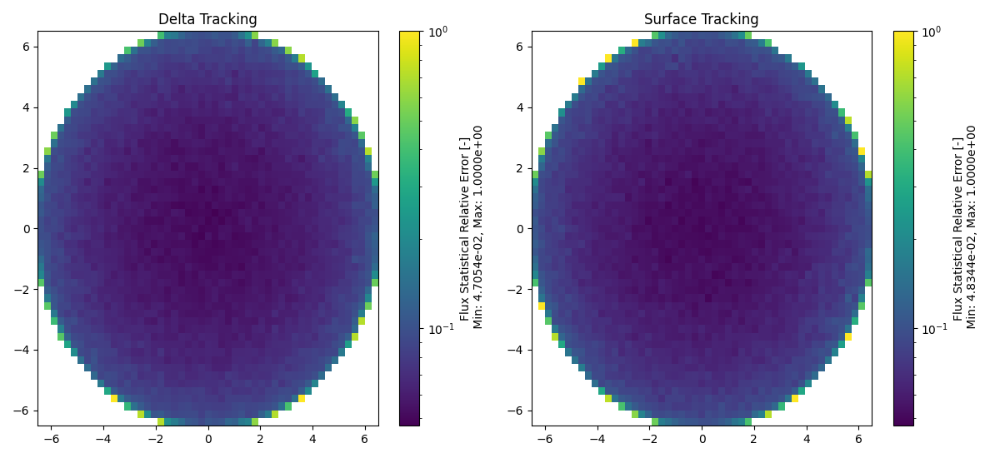

Flux statistical relative error distribution with 10000 particles per batch.

  

Flux statistical relative error distribution with 100000 particles per batch.

### Relative Error Distributions

  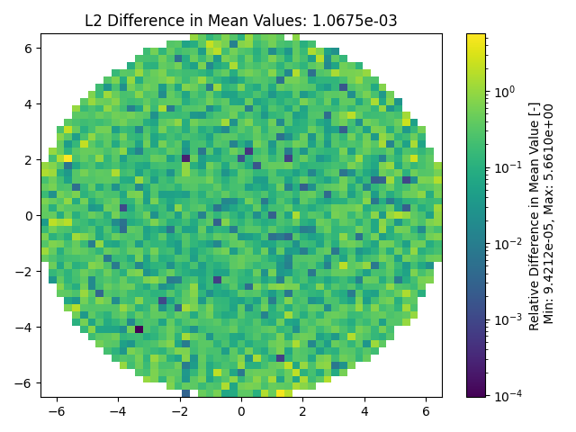
  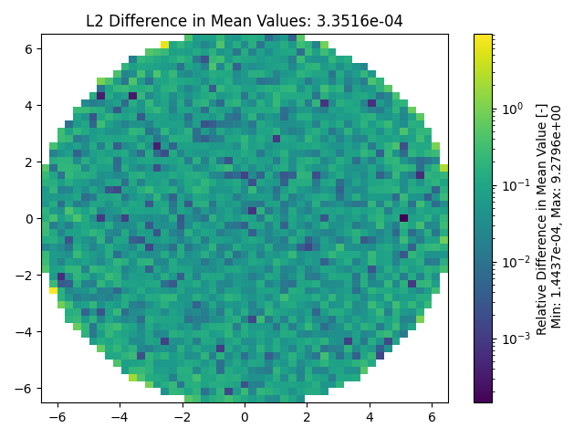
  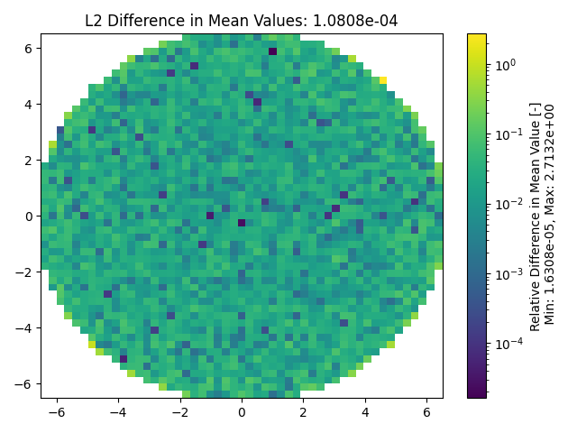

Relative difference distributions between tracking modes for 1000, 10000, and 100000 particles per batch (left to right).

