# Testing Results

## 11th Gen Intel Core™ i7-11800H (16 threads)

Hash: 78abc529c68ba1258030650ccba6d865fbaa0fbd

- Particles: 1,000
- Active batches: 1,000
- Inactive batches: 100

| QOI                     | Delta Tracking       | Surface Tracking     |
| ----------------------- | -------------------- | -------------------- |
| k-eff  (Collision)      | 1.15066 +/- 0.00121  | 1.14841 +/- 0.00115  |
| Leakage Fraction        | 0.01230 +/- 0.00014  | 0.01233 +/- 0.00013  |
| Active Tracking Rate    | 25638.2              | 80337                |
| Inactive Tracking Rate  | 30270                | 90312.9              |

- Particles: 10,000
- Active batches: 1,000
- Inactive batches: 100

| QOI                     | Delta Tracking       | Surface Tracking     |
| ----------------------- | -------------------- | -------------------- |
| k-eff  (Collision)      | 1.14829 +/- 0.00038  | 1.14810 +/- 0.00038  |
| Leakage Fraction        | 0.01209 +/- 0.00004  | 0.01217 +/- 0.00004  |
| Active Tracking Rate    | 23650.3              | 71908.8              |
| Inactive Tracking Rate  | 27941.9              | 97145.7              |

- Particles: 100,000
- Active batches: 1,000
- Inactive batches: 100

| QOI                     | Delta Tracking       | Surface Tracking     |
| ----------------------- | -------------------- | -------------------- |
| k-eff  (Collision)      | 1.14877 +/- 0.00012  | 1.14886 +/- 0.00012  |
| Leakage Fraction        | 0.01202 +/- 0.00001  | 0.01206 +/- 0.00001  |
| Active Tracking Rate    | 24099.8              | 65686.5              |
| Inactive Tracking Rate  | 25611                | 74747.9              |

### Flux Spectra

  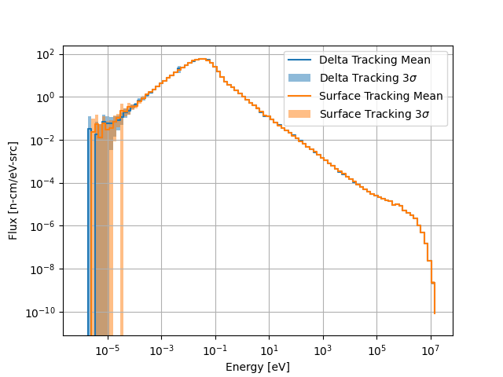
  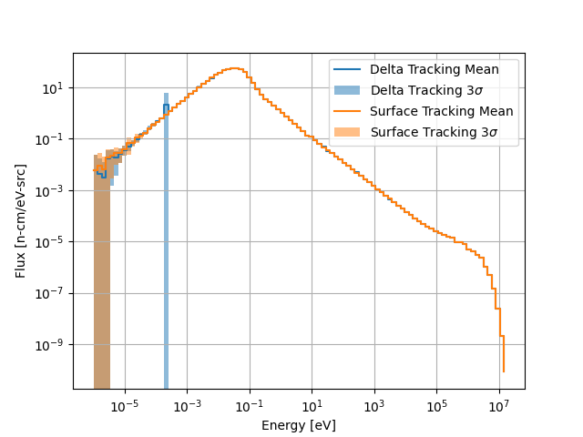
  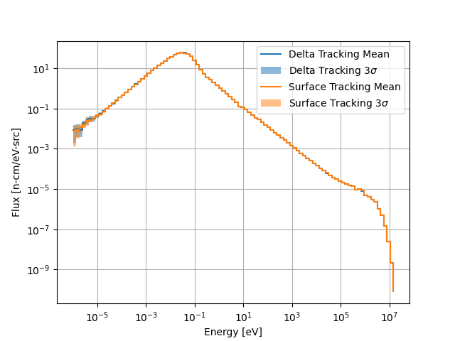

Spectrum comparisons for 1000, 10000, and 100000 particles per batch (left to right).

### Flux Distributions

  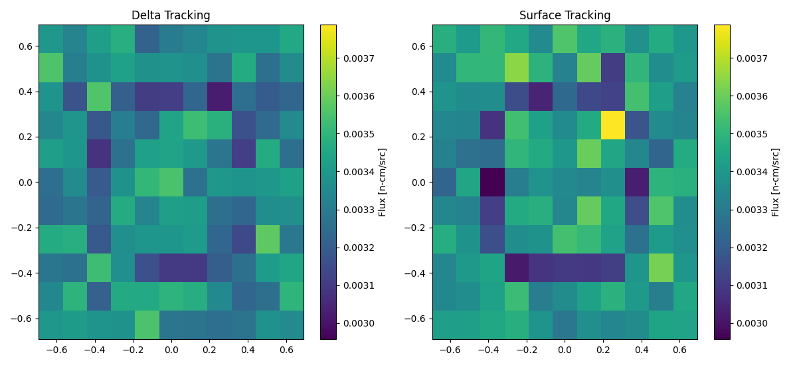

1000 particles per batch.

  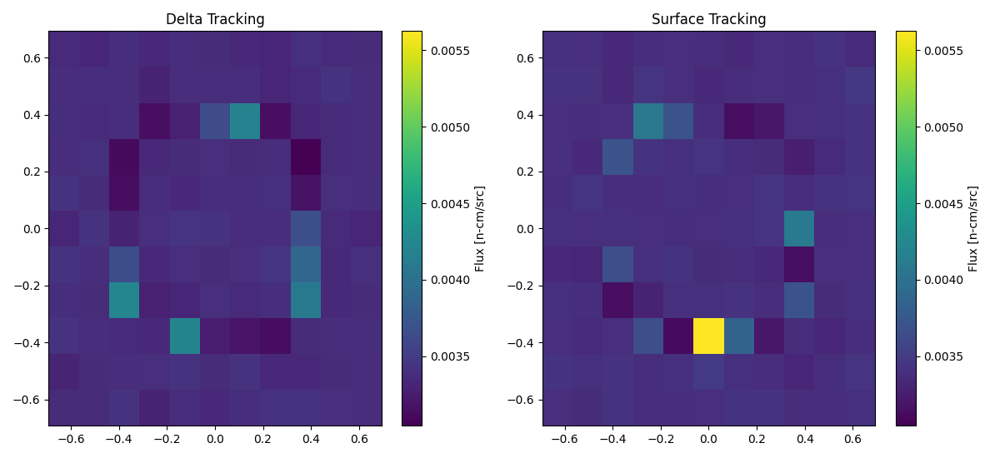

10000 particles per batch.

  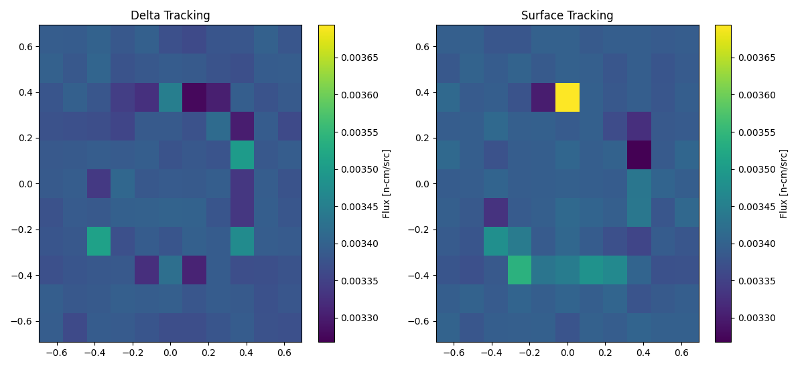

100000 particles per batch.

### Flux Statistical Error Distributions

  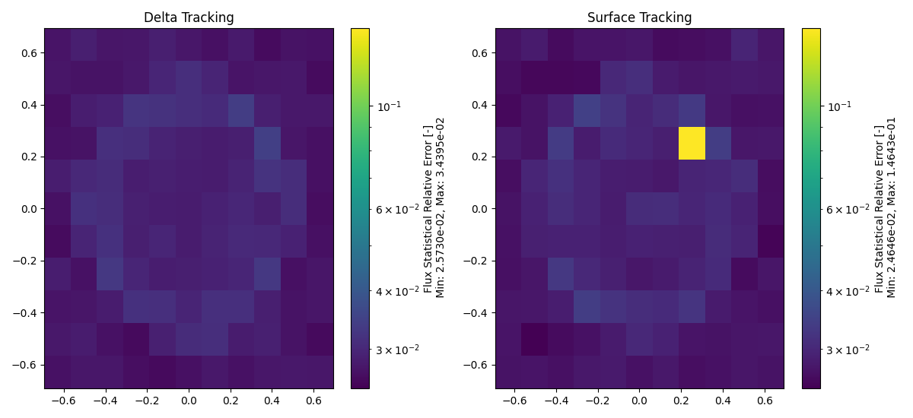

1000 particles per batch.

  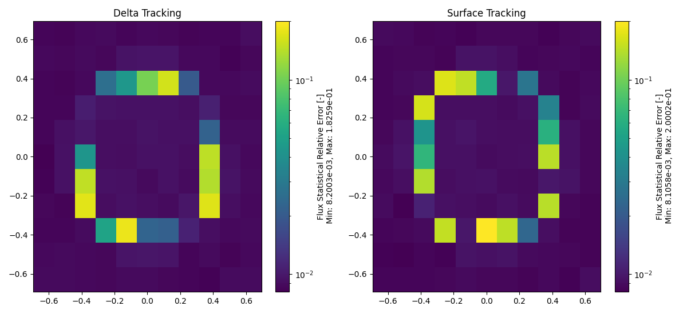

10000 particles per batch.

  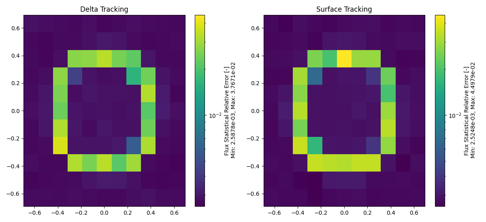

100000 particles per batch.

### Flux Relative Error Distributions

  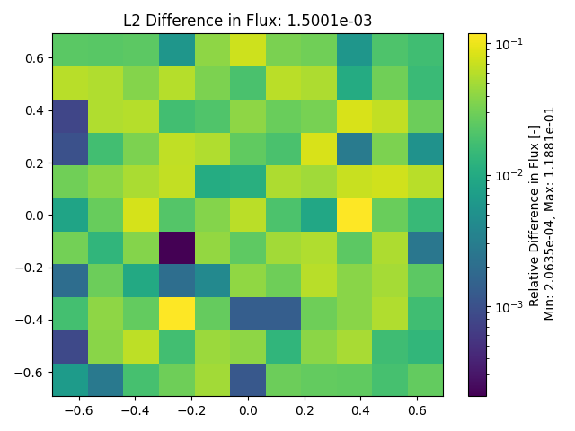
  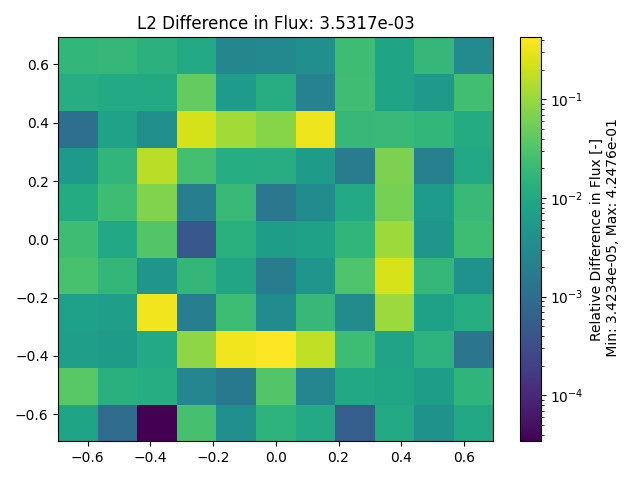
  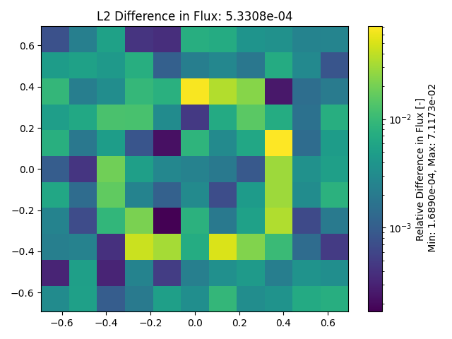

1000, 10000, and 100000 particles per batch (left to right).

### Total Reaction Rate Distributions

  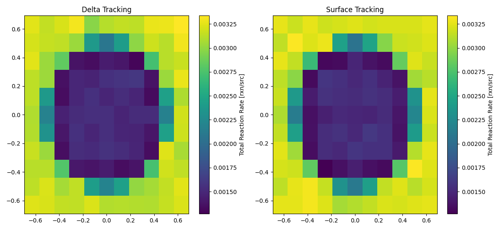

1000 particles per batch.

  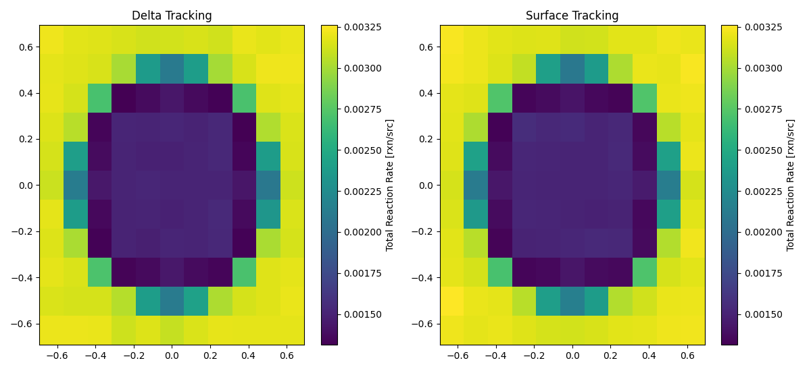

10000 particles per batch.

  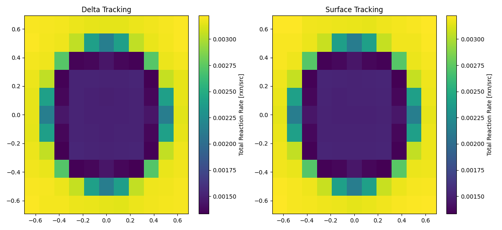

100000 particles per batch.

### Total Reaction Rate Statistical Error Distributions

  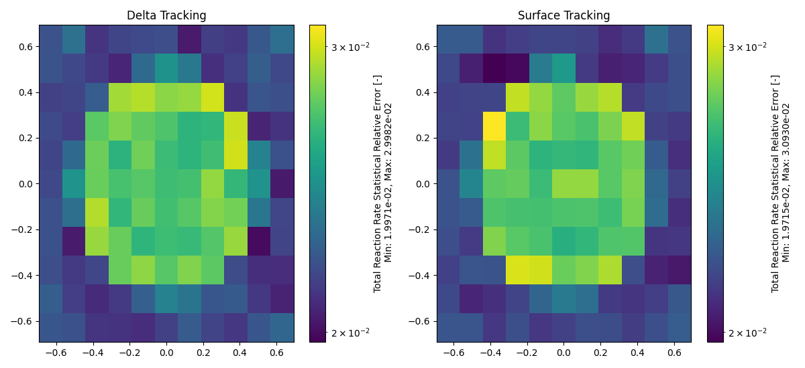

1000 particles per batch.

  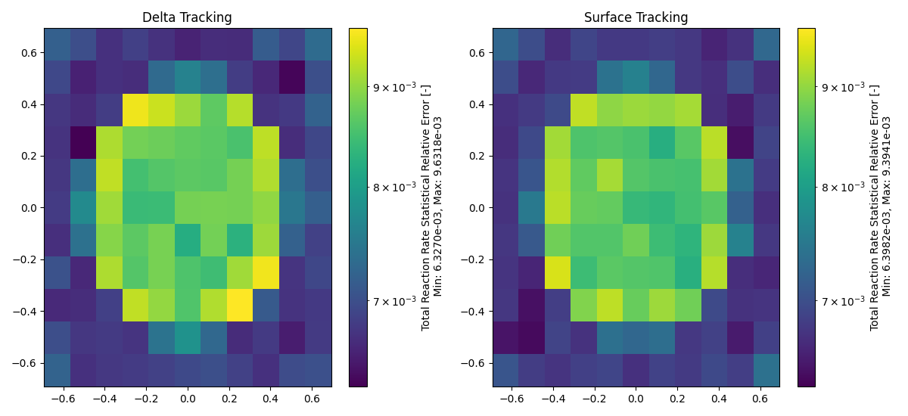

10000 particles per batch.

  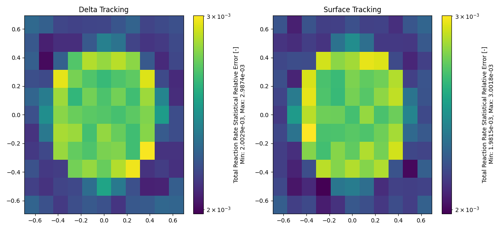

100000 particles per batch.

### Total Reaction Rate Relative Error Distributions

  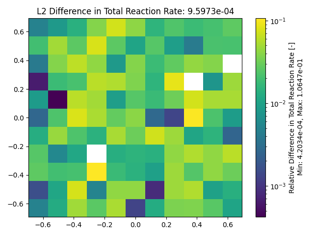
  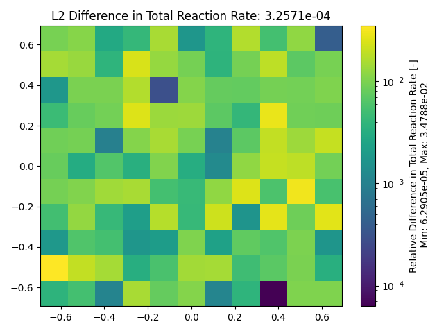
  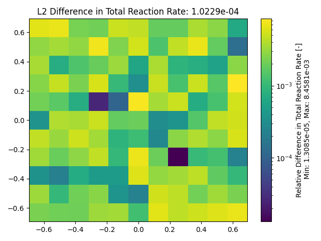

1000, 10000, and 100000 particles per batch (left to right).

