# Testing Results

## 11th Gen Intel Core™ i7-11800H (16 threads)

Hash: 17fee0db263a492ea66758854e2c16ffd036b225

- Particles: 1,000
- Active batches: 1,000
- Inactive batches: 100

| QOI                     | Delta Tracking (old majorant) | Delta Tracking (manual majorant) | Surface Tracking     |
| ----------------------- | ----------------------------- | -------------------------------- | -------------------- |
| k-eff  (Collision)      | 0.98840 +/- 0.00082           | 0.98884 +/- 0.00082              | 0.98964 +/- 0.00082  |
| Leakage Fraction        | 0.14068 +/- 0.00037           | 0.13969 +/- 0.00038              | 0.14056 +/- 0.00037  |
| Active Tracking Rate    | 52998.4                       | 61136.6                          | 31811.6              |
| Inactive Tracking Rate  | 61586.4                       | 78967.1                          | 39973.9              |

- Particles: 10,000
- Active batches: 1,000
- Inactive batches: 100

| QOI                     | Delta Tracking (old majorant) | Delta Tracking (manual majorant) | Surface Tracking     |
| ----------------------- | ----------------------------- | -------------------------------- | -------------------- |
| k-eff  (Collision)      | 0.98785 +/- 0.00024           | 0.98807 +/- 0.00025              | 0.98811 +/- 0.00026  |
| Leakage Fraction        | 0.14035 +/- 0.00012           | 0.14026 +/- 0.00012              | 0.14028 +/- 0.00012  |
| Active Tracking Rate    | 56581.5                       | 66799.4                          | 32679                |
| Inactive Tracking Rate  | 72443.6                       | 87445.8                          | 42711.1              |

- Particles: 100,000
- Active batches: 1,000
- Inactive batches: 100

| QOI                     | Delta Tracking (old majorant) | Delta Tracking (manual majorant) | Surface Tracking     |
| ----------------------- | ----------------------------- | -------------------------------- | -------------------- |
| k-eff  (Collision)      | 0.98830 +/- 0.00008           | 0.98830 +/- 0.00008              | 0.98839 +/- 0.00008  |
| Leakage Fraction        | 0.14015 +/- 0.00004           | 0.14008 +/- 0.00004              | 0.14026 +/- 0.00004  |
| Active Tracking Rate    | 59592                         | 78353.2                          | 34555.7              |
| Inactive Tracking Rate  | 65539.5                       | 86883.7                          | 38022.8              |

### Flux Spectra

  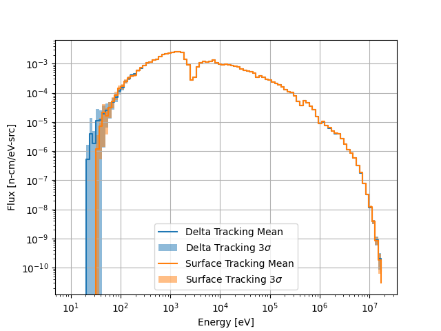
  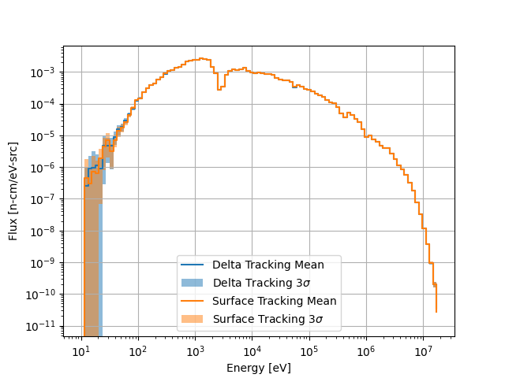
  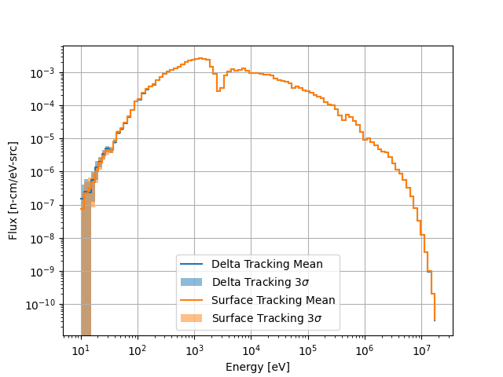

Spectrum comparisons for 1000, 10000, and 100000 particles per batch (left to right).

### Flux Distributions

  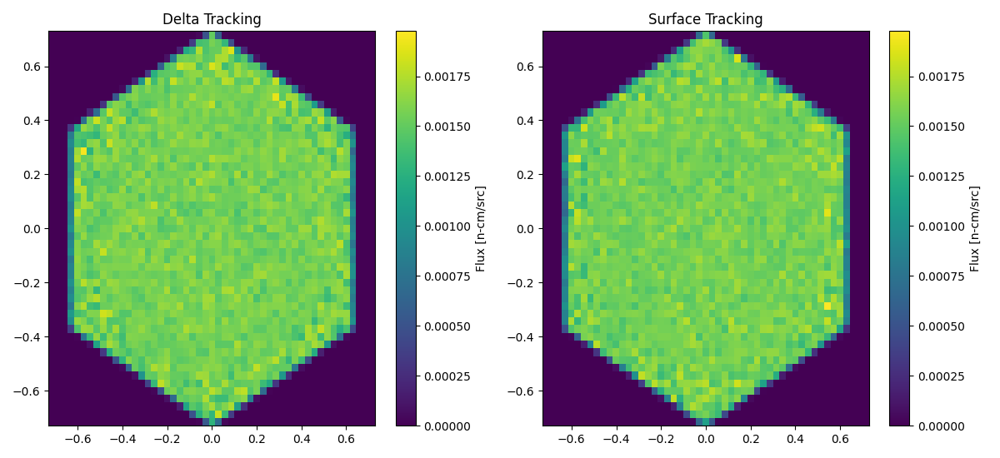

1000 particles per batch.

  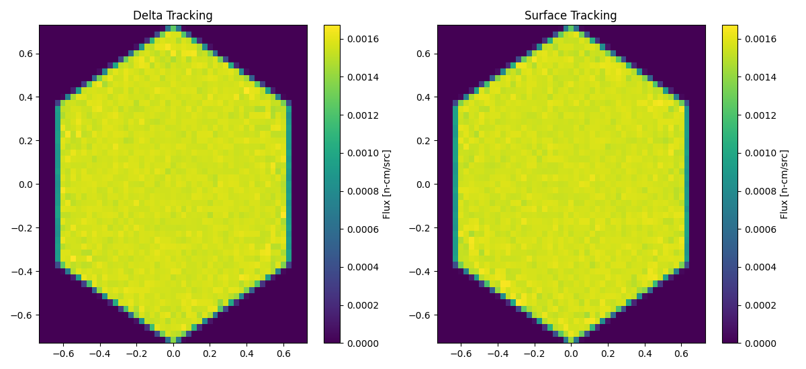

10000 particles per batch.

  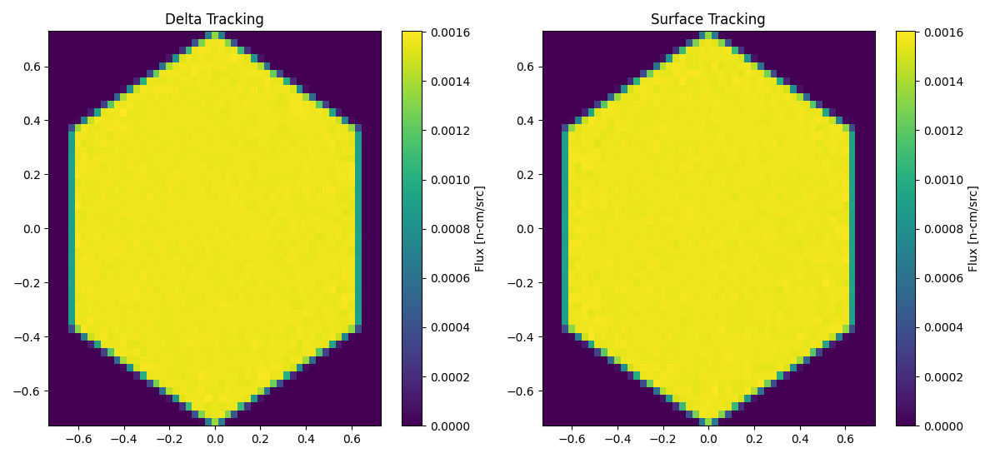

100000 particles per batch.

### Flux Statistical Error Distributions

  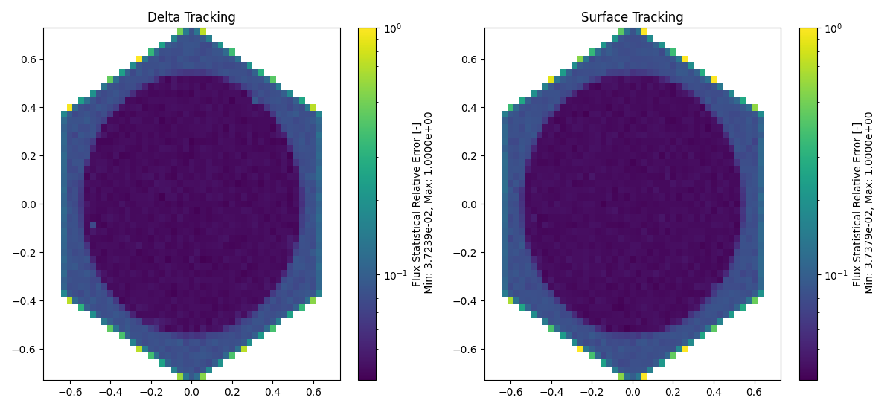

1000 particles per batch.

  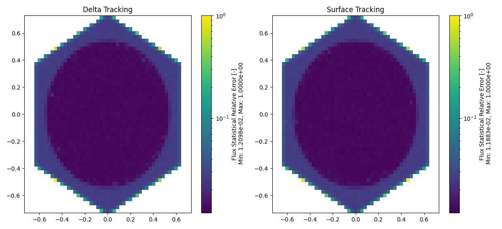

10000 particles per batch.

  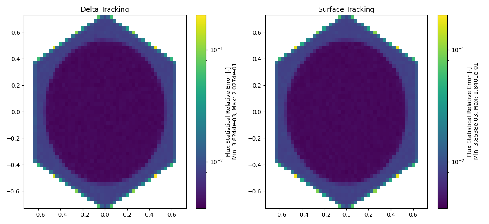

100000 particles per batch.

### Flux Relative Error Distributions

  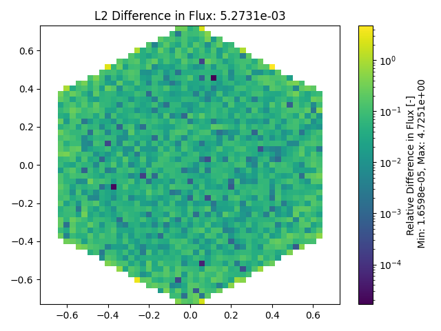
  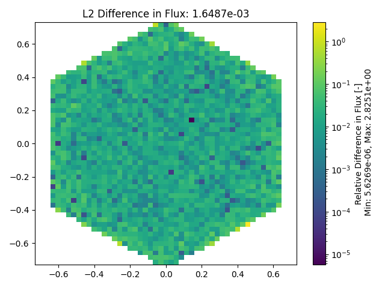
  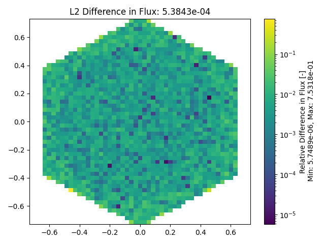

1000, 10000, and 100000 particles per batch (left to right).

### Total Reaction Rate Distributions

  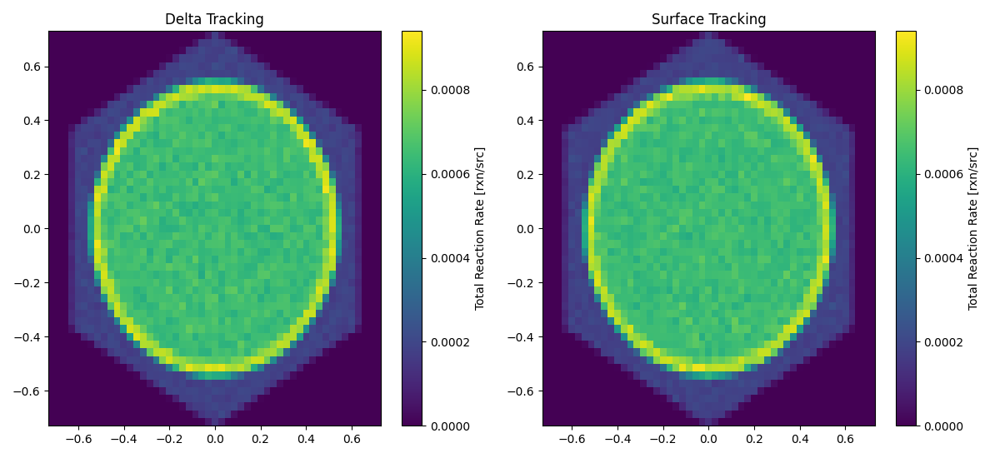

1000 particles per batch.

  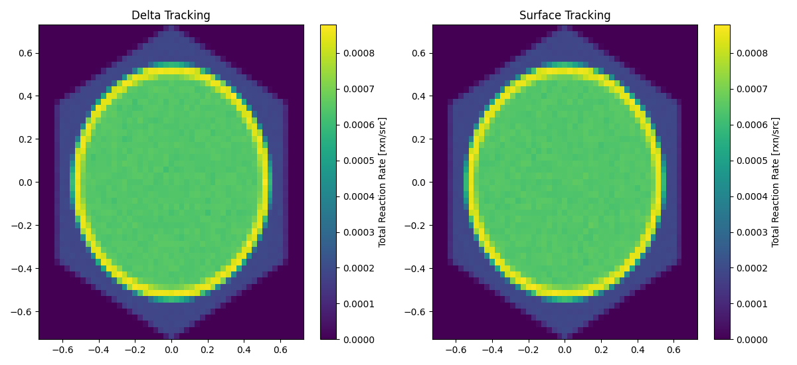

10000 particles per batch.

  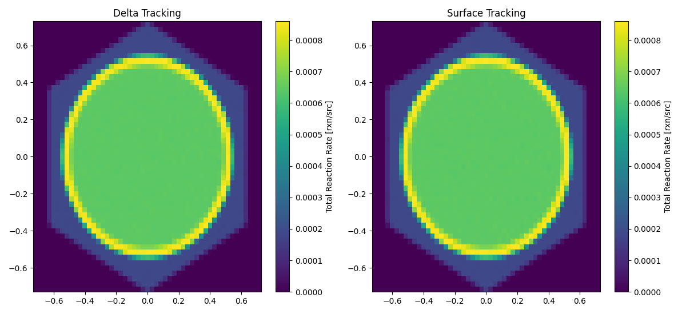

100000 particles per batch.

### Total Reaction Rate Statistical Error Distributions

  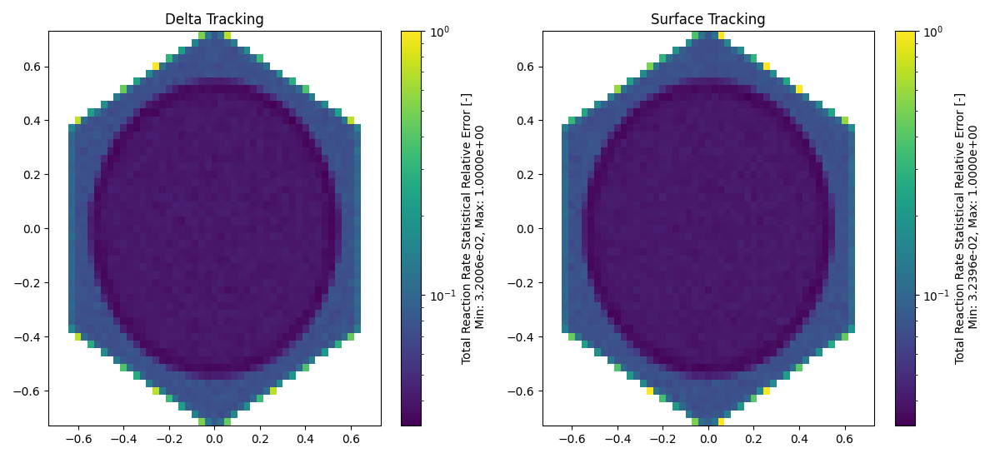

1000 particles per batch.

  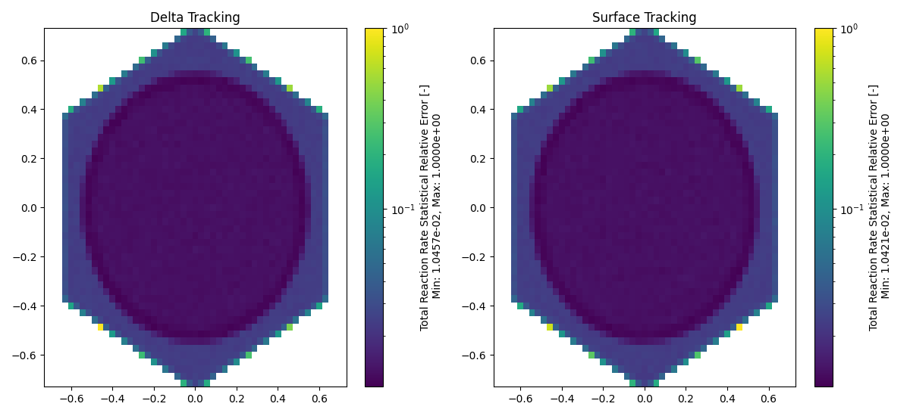

10000 particles per batch.

  

100000 particles per batch.

### Total Reaction Rate Relative Error Distributions

  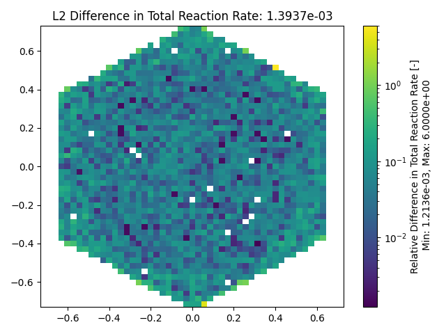
  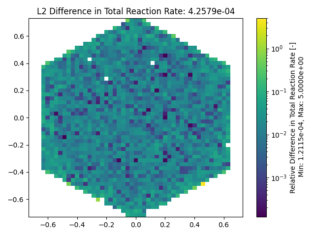
  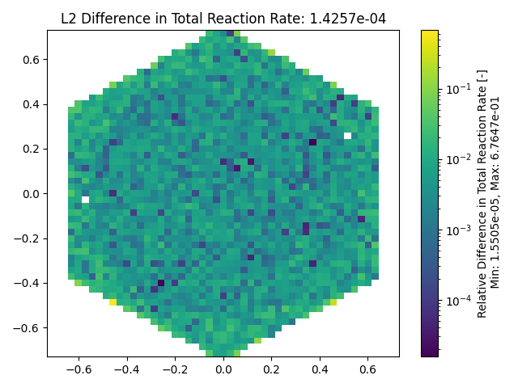

1000, 10000, and 100000 particles per batch (left to right).

